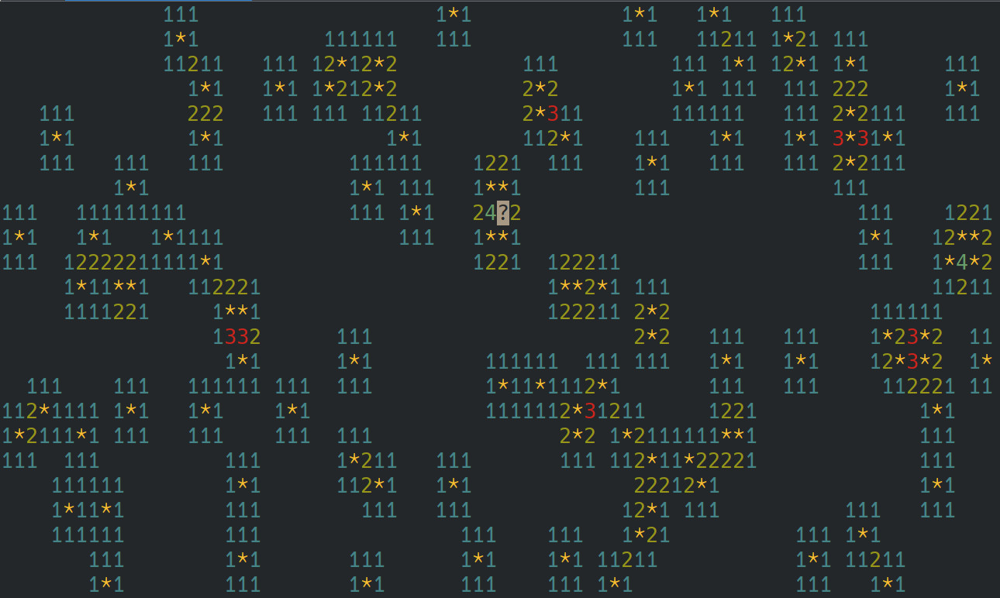

# Alien OS

Screenshot of emulated saper (console version) game:



## Alien spaceship

Recently, an alien spaceship has crashed near the faculty. We managed to extract data carriers containing programs for the very technically advanced AlienOS operating system, but unfortunately no alien computer system survived – so we are not able to run their programs. However, after many months of reverse engineering, we finally managed to find out how the interfaces between the AlienOS kernel and user programs work.

## Task

Write a program that loads AlienOS programs and emulates system calls, allowing you to run AlienOS programs under Linux. For testing, we attach an example program (`prog`) extracted from the spacecraft (unfortunately, we have no idea what this program does). Your loader should of course work with any alien program using the AlienOS interface.

## Solution format

As the solution, you should deliver an archive containing:
 - any number of source files with the solution code
 - a Makefile that can build the solution, or a corresponding file from another sensible build system (eg cmake)
 - a readme file with a brief description of the solution

The solution code should be written entirely in C (or C++ if you really want to) and can use any sane libraries available in the Debian system. The solution should compile to a program called emu that can be launched as follows:

```bash
./emu <alien program> [<parameters for alien program>]
```

After the alien program finishes running, the emu program should end with the same exit code as the alien program.

The loader should check correctness of the input data to a reasonable degree. In particular, it should be remembered that a crashed alien ship is not a trusted source of code – you must ensure that the code of the emulated program can not do anything except using known system calls (eg writing / reading arbitrary files). If an error is detected by the emu program, the program should end with the exit code 127.

## Hints

Based on the documentation found on the spacecraft, our team of extraterrestrial linguistics found that the example program is probably controlled by the arrow keys, space bar, and enter. It takes one parameter whose sensible values are in the range of 50-400. It requires a terminal size of at least 80×24.

The easiest way to emulate AlienOS system calls is to use ptrace with the `PTRACE_SYSEMU` option.

To implement the `getrand` system call from the AlienOS system, we recommend using the Linux system call `getrandom`, or a sensible `PRNG` initiated with such a call.

You can use the `ncurses` library to handle the terminal, or issue the appropriate codes yourself (`man console_codes`).

The colors of the characters given in the documentation are just an approximation (aliens see the colors differently than humans) and you can use any reasonably similar colors in the Linux terminal.

